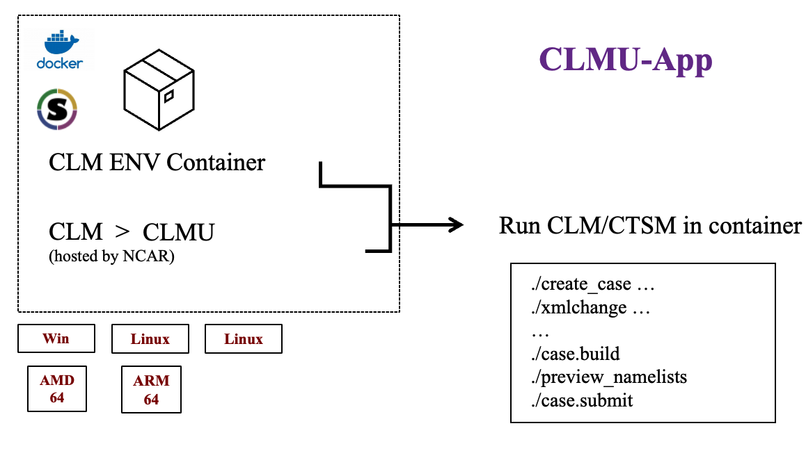

CLM ENV Container detail
========================

Base environment:

- OS = `Fedora 31`

Major apps: 

- Compiler = `GCC 9.3.1`
- Cmake = `3.18` 
- netcdf-c = `4.7.0-2` 
- netcdf-fortran = `4.5.2-3` 
- python = `3.7.9` 
- svn = `1.12` 

.. warning::
    The clmu-app currently does not provide ESMF as we want a compact container. The ESMF is important for making your own data of other mode of single points. We recommend to prepare the date out of the clmu-app, and then bind/import them to clmu-app to run the special single point case. If ESMF is still need, user can install it as follow:

How to install ESMF?
--------------------

.. code-block:: shell

    # Required envs for building libraries
    ENV ESMF_DIR=/tmp/bld/esmf-ESMF_8_0_1
    ENV ESMF_INSTALL_PREFIX=/usr/local
    ENV ESMF_INSTALL_MODDIR=include
    ENV ESMF_INSTALL_LIBDIR=lib
    ENV ESMF_INSTALL_BINDIR=bin
    ENV PATH="/usr/lib64/openmpi/bin:${PATH}"

    # Build and install ESMF libraries
    cd /tmp/bld 
    wget -c https://github.com/esmf-org/esmf/archive/ESMF_8_0_1.tar.gz 
    tar zxf ESMF_8_0_1.tar.gz 
    cd esmf-ESMF_8_0_1 
    make -j && make install  
