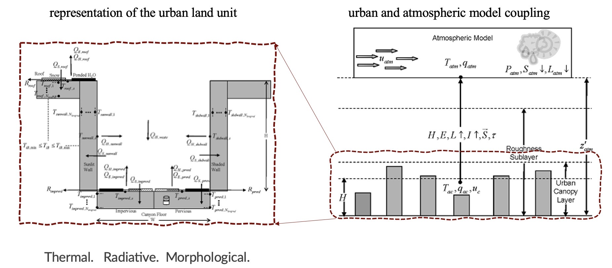

Introduction
============

`What is a container? <https://docs.docker.com/guides/walkthroughs/what-is-a-container/>`_
-----------------------------------------------------------------------------------------------
From docker: A container is an isolated environment for your code. This means that a container does not know the machine's operating system or your files. It runs on the environment provided to you by Docker Desktop. Containers have everything that your code needs to run, down to a base operating system. You can use Docker Desktop to manage and explore your containers.

What is CLMU?
-------------
CLMU is the Community Land Model-Urban, hosted by the National Center for Atmospheric Research (NCAR). CLMU acts as an urban model with a single-layer canopy scheme under the Earth system model hierarchy. 

See more details in `CLM Technical Note <https://escomp.github.io/ctsm-docs/versions/master/html/tech_note/Urban/CLM50_Tech_Note_Urban.html>`_.  

Why use a container for CLMU?
-----------------------------
Running CMLU within CLM (Community Land Model) requires a Linux operation system with certain `software requirements 
<https://escomp.github.io/CESM/versions/cesm2.2/html/introduction.html#cesm2-software-operating-system-prerequisites>`_. Without professional support from technicians, it is a challenge for scientists or other potential users to port the CLM running environment by themselves. Here, we use a container to build an ENV fitting the recent version of `CTSM/CLM <https://github.com/ESCOMP/CTSM>`_. Further, we can apply the container on cloud platforms or local computers to conduct some interesting experiments.

.. note::

    Running a global CESM/CTSM case requires a lot of computing resources that **HARDLY** be done on a local computer. Therefore, the clmu-app only serves a **single point** of simulation, and it is not recommended to use container for global simulation. Therefore, we recommend using this container for the following related research:

    - single point case, e.g., `PTS mode <https://escomp.github.io/ctsm-docs/versions/master/html/users_guide/running-single-points/running-pts_mode-configurations.html>`_
    - test case on local before an expensive simulation
    - urban climate exploration e.g., test urban parameter sensitivity

.. note::
    PTS mode currently **CAN NOT** run with initial conditions, however, we can still can take advantage of this mode. Firstly, we can run case for longer time simulation to get the stable conditions. Moreover, although the land use models is model simulations are sensitive to initial soil moisture conditions, the urban module (CLMU) is less affected by soil. 
    
    We compared two cases of different simulation times of New York Grid ``lat=40.05``, ``lon=-73.75``, ``res=f09_g16``, ``compset=2000_DATM%CRUv7_CLM50%SP_SICE_SOCN_SROF_SGLC_SWAV``. The 2015 JJA average **TREFMXAV** of high density urban between the case of simulation time of 2005-2015 and the case of simulation time of 2015 JJA were compared. Their difference is `0.009 K`. However, it should be noted that the difference in `vegetated_or_bare_soil` land unit is `0.123 K`, which is more significantly affected than urban. We recommend a long time simulation or spin-up for the experiments need non-urban variables.

Python for urban climate exploration
------------------------------------
We apply some Python codes to help run a case of CLM to explore urban climate. 

