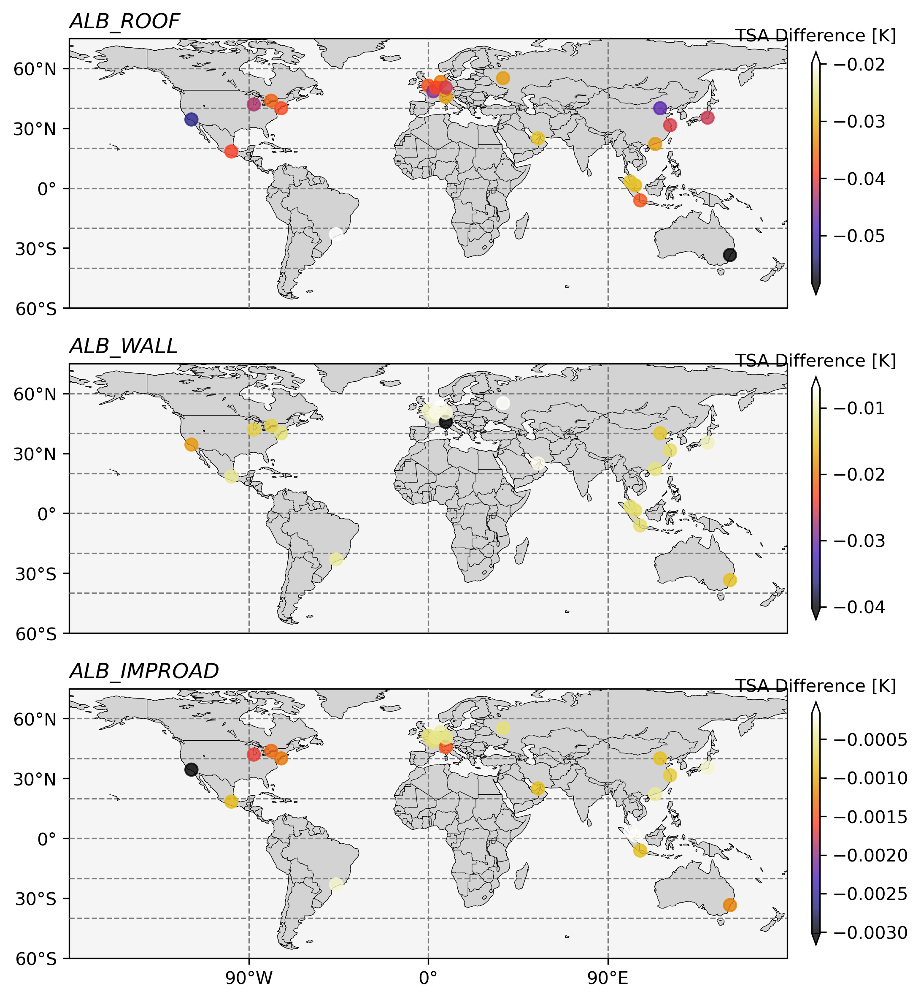
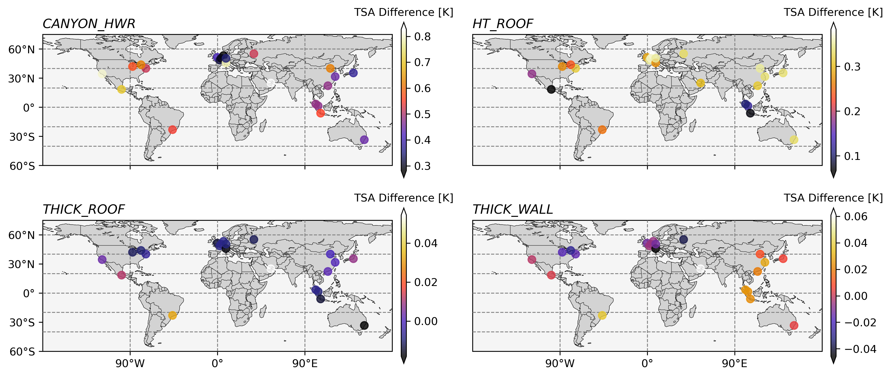
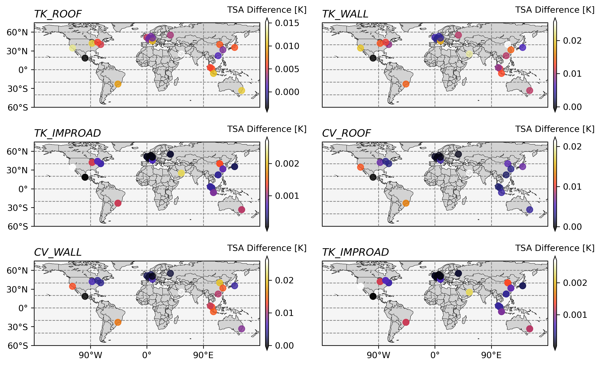

# Exploration of climate sensitive of different urban parameters using clmu-app


As the examples describe, one of the useful functions of clmu-app is to explore the urban climate with a changing urban surface parameters. Investigating this, we can gain information on urban planning/design or offer opportunities for other urban related subjects.

Here we explored the 24 girds that contain most developed cities in the world (ref: https://en.wikipedia.org/wiki/Globalization_and_World_Cities_Research_Network ). 

We selected three categories of urban parameters, including morphological, radiative and thermal index. The CLMU can simulate 3 urban class. Only the high density urban is considered in this experiment as HD has an obvious urban effect and is ubiquitous in each grid. 

**Results preview**


Env: clmu-app

- Forcing: DATM SSP370
- Simulation year: 2055 
- New York Grid
- Compset:SSP370_DATM%CPLHIST_CLM50%SP_SICE_SOCN_SROF_SGLC_SWAV
- Resolution: f09_g17
- Run type: cold start

Primary results:
Each HD urban surface parameters increased by 1.2 times respectively.
- TSA: Surface 2m temperature (yearly average), K 
- TSA difference: difference in result of changed urban surface and no change.


<center>Radiative sensitives. </a></center>

---


<center>Morphological sensitives. </a></center>

---


<center>Thermal sensitives. </a></center>

**ref code**

```

import os
os.chdir('/home/zhonghua/docker/DRL_urban_climate_adaptation/RLctsm/')

import sys
sys.path.append('/home/zhonghua/docker/DRL_urban_climate_adaptation/RLctsm/')

from utils.cesm import *
from utils.ini_env import *
def run_case(i, sur_var, case_year="2055", script_name = "PTS_SSP370_up.sh"):
    print(now_time())

    CASESCRIPT = "/p/project/clm5.0/cime/scripts"
    CASESCRIPT_local = "/home/zhonghua/p/project/clm5.0/cime/scripts"
    CASEROOT_local = "/home/zhonghua/p/scratch/CESMDATAROOT/CaseOutputs"
    DOUT_S_ROOT = "/home/zhonghua/p/scratch/CESMDATAROOT/Archive"

    scriptpath = f"./scr/{script_name}"
    configpath = "./notebook/config_SSP370_up.json"

    cesm = cesm_run(CASESCRIPT, CASESCRIPT_local, CASEROOT_local, DOUT_S_ROOT, configpath)

    cesm.config['case_lat'] = case_loc[i]['case_lat']
    cesm.config['case_lon'] = case_loc[i]['case_lon']
    
    cesm.config['case_start_year'] = case_year
    cesm.config['case_end_year'] = case_year

    cesm.config['fsurdat'] = cesm.config['fsurdat'].replace('env_id',str(i)+"_"+cesm.config['case_name'])
    local_fsurdat_temp = copy.deepcopy(cesm.config['local_fsurdat']).replace('env_id','')
    cesm.config['local_fsurdat'] = cesm.config['local_fsurdat'].replace('env_id',str(i)+"_"+cesm.config['case_name'])

    # copy the surface data
    copy_file_if_not_exists2(local_fsurdat_temp, 
                                cesm.config['local_fsurdat'],
                                cesm.config['case_lon'],
                                cesm.config['case_lat'],
                                )

    with open(f"/home/zhonghua/p/pyscripts/{script_name}", "w") as f:
        f.write(cesm.create_case(scriptpath))

    alb_paramdict = dict(lsmlat=0, lsmlon=0, numurbl=1)

    if sur_var == "None":
        pass

    else:
        ds = xr.open_dataset(cesm.config['local_fsurdat'])

        if sur_var in ['ALB_IMPROAD','ALB_ROOF','ALB_WALL'] :

            actions = {
                    sur_var+"_DIR": ds[sur_var+"_DIR"].loc[alb_paramdict].values * 1.2,
                    sur_var+"_DIF": ds[sur_var+"_DIF"].loc[alb_paramdict].values * 1.2,}

        else:

            actions = {sur_var: ds[sur_var].loc[alb_paramdict].values * 1.2}

        # * Modify the surf file
        cesm.modify_surf(var=None, action=actions, param_location=alb_paramdict)

    # password = "***"
    password = "***"

    # change the permission of the script
    command_0 = f"sudo -S docker exec myclmu chmod +x /p/pyscripts/{script_name}"
    run_command(command=command_0, password=password)

    # run the script
    command = f"sudo -S docker exec myclmu sh -c '/p/pyscripts/{script_name}' "
    run_command(command=command, password=password)

    l = ['TREFMNAV','TREFMXAV','TSA','RH2M']
    ds = cesm.nc_view()

    result = {}

    for var in l:
        ds1 = ds[var].assign_coords({'landunit': ds['land1d_ityplunit'].values})
        result[var+"_u"] = ds1.sel(landunit=8).values.flatten().tolist()
        result[var+"_r"] = ds1.sel(landunit=1).values.flatten().tolist()

    script = "sudo -S rm -rf " + cesm.config['local_fsurdat']
    subprocess.run(script, input=password, text=True, check=True, shell=True)

    return result

Temperature = {}


var_ls ={"morphological":['CANYON_HWR','HT_ROOF','THICK_ROOF','THICK_WALL'],
        "radiative": ['ALB_IMPROAD','ALB_ROOF','ALB_WALL'],
        "thermal":[ 
        'TK_ROOF','TK_WALL','TK_IMPROAD','CV_ROOF','CV_WALL','TK_IMPROAD']
}

var_ls_ls = ['None']

for i in range(1, 25):
    for sur_var in var_ls_ls:
        result = run_case(i=i, sur_var=sur_var)
        Temperature[str(i)+sur_var] = {
            "data": result,
            "loc": case_loc[i], 
            "action": sur_var
        }
        
        with open("SSP370_urban_properties_none.json", "w") as f:
            json.dump(Temperature, f)

    # reset the cases
    command_0 = f"sudo -S docker exec myclm rm -rf /p/scratch/CESMDATAROOT/CaseOutputs/ssp370up"
    run_command(command=command_0, password="Manchestermedal")
    command_1 = f"sudo -S docker exec myclm rm -rf /p/project/clm5.0/cime/scripts/ssp370up"
    run_command(command=command_1, password="Manchestermedal")

```


